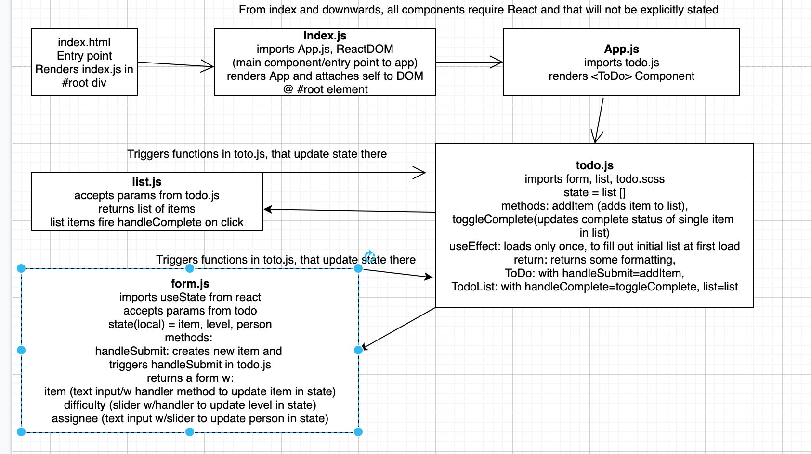

# Task Manager

A simple Task Manager that allows the user to create tasks, delete tasks, and update the status of the tasks. Tasks are assigned to an individual at the time of creation.

New functionality added: ability to sort task by status, assignee, completeness, etc. Tasks are now paginated to display a max of 5 tasks at a time per page.

Display and functionality of app is now graded by the level of the user. Users must be logged in to interact with the app. Users can create a new account and (this is just for a display of functionality) they can set their role when logging in to user, editor, or admin (which will establish differing levels of access to the app)

[Api for Database Connection](https://at-taskmanager.herokuapp.com/task)

[Github with Passing Test Suite for Server](https://github.com/AnneThor/todo-server)

[Live Version Front End at Netlify](https://taskmanager-at.netlify.app/)

## Setup

`.env` requirements: none currently

## Running the app
npm start

## Tests
Functionality Tests: npm test

Front end functionality for different levels of access can be tested with the following credentials (username: password)

- Admin: Admin
- Editor: Editor
- User: User

## UML at Week 4

